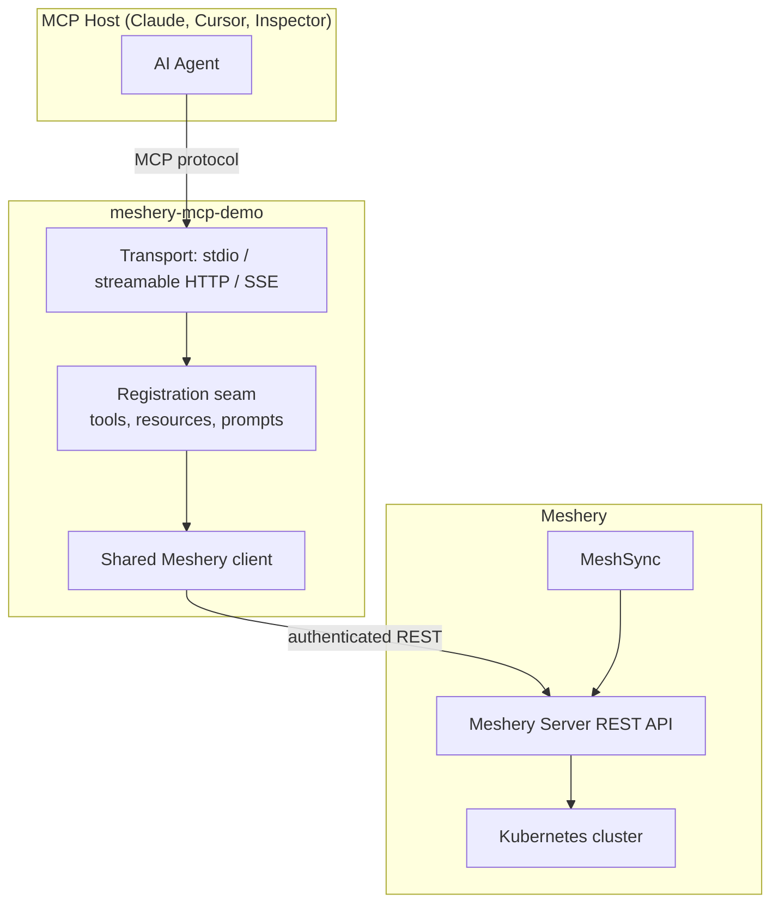

# Meshery MCP Demo

[](https://go.dev)
[](LICENSE)
[](https://github.com/AkashNaickar/meshery-mcp-demo/actions/workflows/build-and-test.yml)

A working proof-of-concept of a [Model Context Protocol](https://modelcontextprotocol.io) server for [Meshery](https://meshery.io), built in Go. It lets AI agents observe and operate Meshery: list designs, inspect live cluster topology, and deploy designs to Kubernetes through natural tools, resources, and prompts.

> This is a POC demonstrating the architecture proposed for the [Meshery MCP Server](https://github.com/meshery-extensions/meshery-mcp-server) project: every MCP surface registers through one shared seam, backed by a single authenticated Meshery client.

## Demo

[](https://github.com/user-attachments/assets/REPLACE_WITH_DEMO_VIDEO_ID)

_Demo video: driving the server from MCP Inspector, deploying a design, and watching the topology resource update live._

## Architecture



## What it demonstrates

| MCP surface | Name | What it does |
|---|---|---|
| Tool | `server_info` | Metadata about the MCP server |
| Tool | `list_designs` | List designs stored on Meshery (`GET /api/pattern`) |
| Tool | `list_kubernetes_contexts` | List Kubernetes contexts Meshery manages (`GET /api/system/kubernetes/contexts`) |
| Tool | `deploy_design` | Deploy a design (PatternFile YAML) to a context; dry-run supported (`POST /api/pattern/deploy`) |
| Resource | `meshery://clusters/{cluster_id}/topology` | Live MeshSync-discovered cluster topology as a graph (`GET /api/system/meshsync/resources?asDesign=true`) |
| Prompt | `deploy_application` | Guided workflow steering the agent through context, design, deploy, verify |

The registration seam (`internal/server/registrant.go`) is the architectural centerpiece: tools, resources, and prompts all implement one `Registrant` interface, so adding a surface is one file plus one line in the registry.

## Quickstart

### Prerequisites

- Go 1.26+
- A running Meshery Server (see [meshery.io/docs](https://docs.meshery.io)) with a connected Kubernetes context
- `mesheryctl` authenticated: `mesheryctl system login` writes `~/.meshery/auth.json`

### Run

```bash
go build -o bin/meshery-mcp-demo ./cmd/meshery-mcp-demo

# stdio transport (default, for Claude Desktop / Cursor)
./bin/meshery-mcp-demo

# streamable HTTP transport
MESHERY_MCP_TRANSPORT=http ./bin/meshery-mcp-demo

# or via MCP Inspector
npx @modelcontextprotocol/inspector ./bin/meshery-mcp-demo
```

### Configuration

| Environment variable | Default | Description |
|---|---|---|
| `MESHERY_SERVER_URL` | `http://localhost:9081` | Meshery Server base URL |
| `MESHERY_TOKEN_PATH` | `~/.meshery/auth.json` | Path to the mesheryctl auth file |
| `MESHERY_API_TOKEN` | unset | Raw token that overrides the auth file |
| `MESHERY_MCP_TRANSPORT` | `stdio` | `stdio`, `http`, or `sse` |
| `MESHERY_MCP_HTTP_ADDR` | `127.0.0.1:8080` | Listen address for http/sse |

### Seed sample data

```bash
./scripts/seed.sh        # bash
.\scripts\seed.ps1       # Windows PowerShell
```

## Development

```bash
make test    # go test ./... -race
make lint    # golangci-lint run
make build   # build to bin/
```

CI runs lint, vet, race-enabled tests, and cross-platform builds (linux/windows/darwin x amd64/arm64).

## License

Apache License 2.0. See [LICENSE](LICENSE).